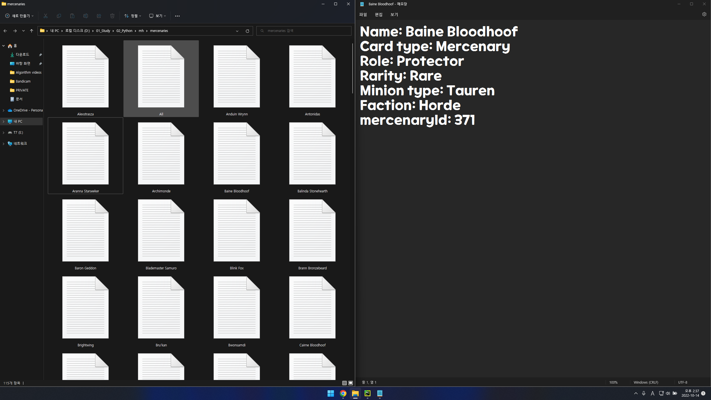
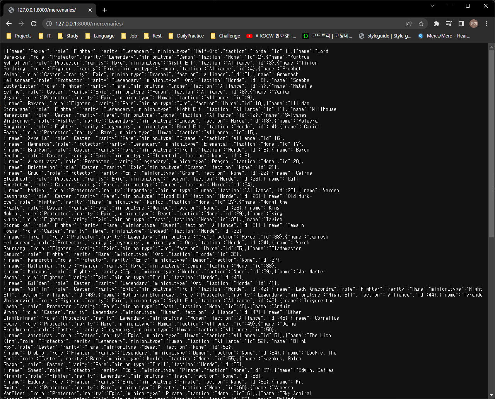

# Hearthstone Mercenary Helper

---

## Description
It helps users play mercenaries, one of the Hearthstone game modes, comfortably

### Environment

### Features

Scraping mercenaries information from Hearthstone wiki and store it as text files. Storing them into local database after that.
Validate data before insert it. It only allows non-duplicated names.

**Run Server**

**Store Data As Text Files**

**Store Data Into DB and Get Them**

## TODO

1. Get various information in the game such as items, skills and bosses
   1. Set relevant relationships between those data
   2. Implement CRUD methods 
2. Implement functions that recommend decks base on user input
   1. Make user interface so it can get user input
3. Make test codes and perform unittest
4. Complete the README and refactor codes

## Testing

### unittest

